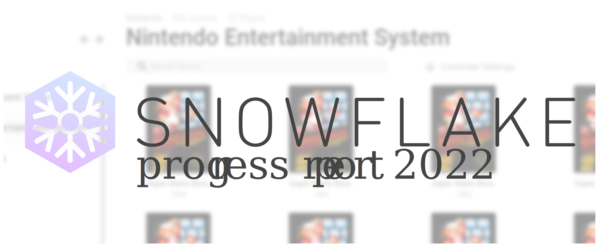
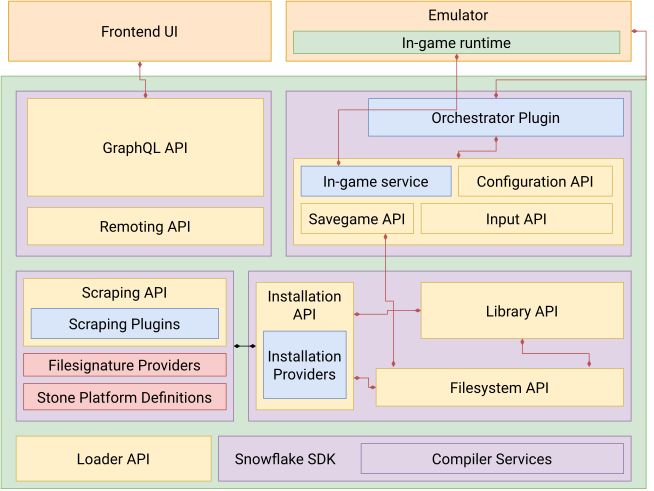

It's been a crazy couple of years since the last blogpost, as well as a very busy couple of years for myself. Despite that I've been slowly working on Snowflake in ways both big and small, I just haven't found the time to blog about it. This progress report will discuss some of the major and minor changes in Snowflake these past two years, as well as including a short overview of the architecture to explain what makes Snowflake different from other frontend solutions. Snowflake is honestly shaping up to be a [yak shave](https://projects.csail.mit.edu/gsb/old-archive/gsb-archive/gsb2000-02-11.html) after [yak shave](https://yakshav.es/the-patron-saint-of-yakshaves/), just so I can play *Final Fantasy VII* but I've learned lots so that's fine with me. After years of design and iteration, I'm mostly satisfied with how things are architecturally, but there's still a couple of items on the menu that I'm not satisfied with (like how input is handled), so I'd love to get some feedback as well from both emulator and frontend developers. Snowflake is a huge API so I don't expect anyone besides myself to be familiar with its inner workings, but I've ensured that everything I do comes with high quality documentation and test cases to provide a seamless developer experience... as soon as it's out of the oven.

## A (re)-introduction to Snowflake
While I've tried to explain what Snowflake is in past blog posts, I've never really given a clear picture of its architecture and how its unique from other emulator frontends. 

Snowflake is not a frontend by itself, but implements the required services of a frontend; it handles everything except the UI. On top of that, it aims to provide an extensive SDK to support the following features.

* Proper handling of multi-file/disc games, including those that need to be extracted and installed from package.
* Multi-stage, multi-input intelligent game scraping from a variety of sources.
* Full game and input configuration via the frontend interface.
* Support fullscreen to windowed UIs in any language with the same core, supporting the same features.
* Platform-wide save game management and history
* Unified in-game support for common operations such as pausing, disc swap, fast-forward if supported.
* Minimal setup for supported emulators.

Unlike some other solutions, Snowflake can do this **without having to edit a single line of emulator code**. This means that the only thing that has to be maintained between emulator updates is a relatively small amount of 'glue' code, which can be done without the involvement of the emulator developer themselves. Not only does this reduce the support burden for emulator developers, it is a much more maintainable approach without needing to fork the original emulator, while keeping most of the niceties of a more integrated approach. This is accomplished through configuration generation, input and graphics hooking, and a big API to bind them. 

Snowflake provides a rich SDK and is built on top of a modular loader architecture to be extendible. Only a [very small set of base services](https://github.com/SnowflakePowered/snowflake/blob/master/src/Snowflake.Framework.Services/ServiceContainer.cs#L37) are used to bootstrap the host, and everything else is implemented as plugins&dagger;. On top of that flexible base, its architecture provides for everything from scraping, to game installation, to running and orchestrating emulators.



I won't go into the nitty-gritty details of this architecture diagram above, (if you're interested, I have a somewhat up to date [ARCHITECTURE.md](https://github.com/SnowflakePowered/snowflake/blob/master/ARCHITECTURE.md) in the main repository).

Notice the separation of concerns with UI and emulation. A [rich and robust GraphQL API](https://docs.snowflakepowe.red/graphql.html) exposes Snowflake's API surface for user interfaces to take advantage of and drive. As I'll detail later on in the next section, I'm working on an Electron-based frontend with React, but since GraphQL is not bound to any one transport, anyone could conceivably write their frontend with toolkits like Qt, [Tauri](https://tauri.studio/), or [Avalonia](https://avaloniaui.net/), if you are averse to Electron's memory requirements. That being said, Snowflake does target a niche of relatively up-to-date and powerful hardware. It isn't built for the Raspberry Pi; many of its features target Windows 10/11 and (eventually) recent versions of Linux. Many of the architectural considerations, especially with library management, were made with emulators like [RPCS3](https://rpcs3.net/), [Cemu](https://cemu.info/), and [yuzu](https://yuzu-emu.org/) in mind, which also require recent up-to-date drivers and operating systems, and decently powerful hardware. 

Regardless, I am yet to be aware of another player on the scene that offers all of what Snowflake promises, and I hope I will be able to deliver on those promises. Just don't bet on it being soon.

<p style="font-size: 12px">
&dagger;Or rather 'modules': <em>plugins</em> in the Snowflake context refers specifically to <em>class instances</em> loaded by the <a href="https://github.com/SnowflakePowered/snowflake/tree/master/src/Snowflake.Support.PluginManager">PluginManager</a>, itself implemented as a module, but I'll be using "plugin" to refer to both plugins and modules in this article to avoid confusion.
</p>

## UX Work Progress ([hydrogen-paper](https://github.com/SnowflakePowered/hydrogen-paper))
Let's start off with some pretty pictures. There has been substantial progress in the design of a frontend UI for Snowflake called *hydrogen*. Work began in earnest in 2020, and is making slow but steady progress. 


This is a mockup of the main library view with all the platforms available on the side. The main game grid can accommodate a variety of boxart ratios, as seen in this following mockup for the Super Nintendo Entertainment System.


You can either quick-play a game by hovering over a game and clicking the quick-play button, or click the box art to go into a detailed view with some metadata, the ability to rate the game, and configure emulator, input, and save options for the game. Each emulator plugin opts in via their orchestrator plugin to the input enumerations supported. For now, we support DirectInput and XInput on Windows as well as a generic Keyboard interface, but I am hoping to expose support for HID and LibUSB device enumeration on Windows. The input story on Linux is much fuzzier, but we'll cross that bridge when its time.

Emulator configuration is achieved via dynamic compilation of configuration files via metadata. I detail an older version of that system in [this blogpost written 6 years ago](/blog/configuration-generation-part1); it has changed much since then but the basic concept remains the same. The main drawback of this system is that configuration remains fixed at the start of emulation and can't be changed on the fly while in game. While I can think of ways around that (mostly involving [`WriteProcessMemory`](https://docs.microsoft.com/en-us/windows/win32/api/memoryapi/nf-memoryapi-writeprocessmemory)), such methods are prone to be fragile and inextensible. That does not mean that *some* degree of in-game control is inaccessible to Snowflake, I will detail that in the overview of the Ingame API and runtime later on.


Snowflake also abstracts over input configuration, and currently handles it via device enumeration plugins, and generation of equivalent input configuration. This turned out to be quite a bit more complicated than regular configuration generation, so I'm still looking for alternate ways to handle input, perhaps with input API hooks in the ingame runtime. 


The final mockup I have to share is the game installer. To accommodate for all the features, games have to be installed to Snowflake's game directories; this is mainly designed for multi-file games like PKG files for PS3 or WiiU games. The actual installation process is also abstracted away into its own plugin so specialized installation processes can be adapter; the installation API is detailed in [this blogpost](/blog/snowflake-in-2020-and-beyond-2020-02-02). The obvious drawback to this is of course the drive space requirements as well as needing to install your game library; particularly with consoles that *don't* require such complicated installation processes. Currently this is handled via symbolic links, which is a bit of a hack but works fine. Snowflake needs to be able to virtualize the entire filesystem root of a game, but I am considering solutions to this problem as well such as implementing a full VFS on the driver level. Of course, this introduces a lot of complexity so it's highly likely the currently symbolic link solution will stay for now.

All of this is fine and good, but these are all just mockups right? Well, I've done substantial work on implementing these mockups but there is still a lot to go. Currently the components are in place for the main game library view and the installation view, but I have yet to properly tackle the game details view with all the configuration and input controls. The main game library makes heavy use of [react-window](https://github.com/bvaughn/react-window) to maintain good performance. 

Feel free to check out the [component demos in full screen](https://snowflakepowe.red/demos/storybook-2022-03/index.html?path=/story/framing--default).

<iframe src="/demos/storybook-2022-03/index.html?path=/story/framing--default" frameborder="0" style="margin-left:-25%;width:150%;height:700px;position:static;"> </iframe>

## Work in Progress -- The Ingame API and Overlays (PR [#836](https://github.com/SnowflakePowered/snowflake/pull/836)) 


The Ingame API is the newest development of Snowflake and a goal I've been working on for the [past 6 years](https://github.com/SnowflakePowered/snowflake/issues/235). Ironically I haven't had much time to play retro games since University, and it was a recent playthrough of [Tokimeki Memorial 2](https://en.wikipedia.org/wiki/Tokimeki_Memorial_2) for (academic!) research purposes that motivated me to pick this up and push for it when I discovered there was no way besides hotkeys to switch discs in [DuckStation](https://www.duckstation.org/) without having to use the Qt UI. This incident convinced me that an OpenEmu style in-game menu is critical for a good user experience and motivated me to dig deep into graphics hooking and programming for the first time.

<p align="center">
  
  <br >
  <em style="font-style: italic;font-size:14px;">Like how OpenEmu does it!</em>
</p>

From a usability point of view, the basic idea is that the Frontend UI has the capability to render its controls on top of the game. Within this in-game menu, the user can select to do certain operations like pause, disc swap, or full-screen. The UI calls a GraphQL endpoint on the emulating instance, which then communicates with the ingame runtime to send hotkeys to the emulator to trigger the desired behaviour. This is limited to what is supported natively by the emulator via hotkeys (or similar systems like RetroArch's [Network Control Interface](https://docs.libretro.com/development/retroarch/network-control-interface/)), but nevertheless should provide enough functionality for a good experience. In the future, I am hoping for projects like GovanifY's [PINE](https://projects.govanify.com/govanify/pine) to develop and become better integrated in popular emulators. 

Implementation wise, the Ingame API consists of a [simple binary protocol](https://github.com/chyyran/snowflake/blob/04f7dddc7d51436565846d84dd9e8e49bc4893be/src/Snowflake.Framework.Primitives/Orchestration/Ingame/GameWindowCommand.cs) between the Snowflake host and the ingame runtime. Overlay rendering is currently done with Chromium Embedded Framework to a [DirectX11 shared texture](https://docs.microsoft.com/en-us/windows/win32/api/d3d11/nf-d3d11-id3d11device-opensharedresource) that is passed to the ingame runtime, which is cross-compatible with [OpenGL](https://www.khronos.org/registry/OpenGL/extensions/EXT/EXT_external_objects.txt) and [Vulkan](https://www.khronos.org/registry/vulkan/specs/1.3-extensions/man/html/VK_KHR_external_memory.html) via recent extensions that allow sharing of GPU memory. This approach is extendable to Linux with the same memory sharing extensions, just requiring a Vulkan rendering source rather than DirectX 11, although I have no plans to do so at the moment. Since this is also modular, we are not limited to CEF, and any arbitrary texture can be opened as shared and rendered ingame.

The ingame runtime is responsible for coordinating with the Snowflake host, and is a small DLL that gets injected into the emulator executable in the same vein as the Steam or Discord overlay. This is proving to be a yak shave on its own. Originally I went for a C# based solution, using a small [bootstrap loader](https://github.com/SnowflakePowered/sabinokaku) to host the .NET runtime within the emulator process when injected. This turned out pretty poorly for Vulkan, which requires early injection to be able to properly hook the addresses of the created device functions. I was able to get it working by reworking my C# loader as a [Vulkan layer](https://vulkan.lunarg.com/doc/view/1.2.154.1/windows/loader_and_layer_interface.html), and hooking early in the device creation chain.


All this chainloading for Vulkan ended up pretty complicated and I was also worried about the performance implications of context switching between native (emulator) code and C#, especially if I want to hook input. There were also some concerns with how this would interact with emulators that already host the .NET runtime such as [Ryujinx](https://ryujinx.org/). That pushed me towards [reimplementing the runtime in pure Rust](https://github.com/SnowflakePowered/snowflake-ingame), which is 100% native code and involves no context switch in a hooked function. The inherently unsafe nature of function hooking and graphics programming makes this very *unidiomatic* Rust but despite challenges such as a lack of mature and maintained imgui backends (which I also encountered with C#), a lighter weight, single DLL to inject or load as a Vulkan layer, without the packaging nonsense of C++ makes Rust an attractive path to take.

The ingame API is still in early development and may end up being the most complex subsystem in Snowflake next to the configuration API, but its showing great promise. I will be adding support for DirectX 11, OpenGL (just need to port from C#), Vulkan, and DirectX 12 to cover all the bases. Input hooking seems to be yet again a more difficult problem due to the variety of ways input can be implemented in various emulators, but it doesn't seem like an insurmountable problem and may end up being much more easier to implement in the end than the current configuration generation based input solution.

## Major API Showcases
The rest of this article are showcases of the various API improvements in Snowflake in the past two years. Since it's been two years since the last progress report, there's a lot to go over. Buckle up.

### (PR [#821](https://github.com/SnowflakePowered/snowflake/pull/821)) Source generator-based Configuration API
Configuration generation has been the driving factor behind Snowflake's approach since its genesis, originating as a [template-based](https://github.com/SnowflakePowered/snowflake/commit/5bf077ac1aec537e397e7cf61fd5ec735f4442ad) solution, to using [reflection-based templating](https://github.com/SnowflakePowered/snowflake/issues/216), then to a [DynamicProxy](https://github.com/SnowflakePowered/snowflake/pull/239) solution. The modern (it feels *really* weird to say that for an unreleased API) solution is rooted in a [syntax-tree based approach](https://github.com/SnowflakePowered/snowflake/pull/376) that, rather than using templates, actually *compiles* the configuration files given some C# metadata allowing the generation of hierarchical configuration formats such as XML, JSON, and even [BML](https://github.com/higan-emu/higan/blob/master/nall/string/markup/bml.hpp). 

While this gives us *enormous* flexibility in what emulators can be supported and what features can be tweaked, the main problem since its inception was that reflection and dynamic proxies, which allow the orchestrator plugin to tweak these settings in a type-safe way, is **incredibly slow**. DynamicProxies helped, but actually compiled C# code at runtime on first run. This meant that every first time you boot up a game, the startup time would be slower since the backing configuration metadata had to be compiled to C# first, before being compiled to an 'intermediate representation' syntax tree, which is then compiled to INI, or JSON, or XML. [Source Generators](https://docs.microsoft.com/en-us/dotnet/csharp/roslyn-sdk/source-generators-overview), introduced in .NET 5, allows us to eliminate the first step, which was the most time-consuming by doing all the compilation of C# metadata to actual implementations, at compile time. The additional control this allows also lets us substantially speed up AST-IR generation, the second step of the process. 

<p align="center">
  
  <br >
  <em style="font-style: italic;font-size:14px;">Metadata and generated code.</em>
</p>

Source Generators (and similarly [analyzers](https://docs.microsoft.com/en-us/visualstudio/code-quality/roslyn-analyzers-overview?view=vs-2022)) are incredibly powerful and let us extend the C# language to our liking. Not only can we save on startup time for game booting, source analyzers let us plug into the C# compiler, and make it easier to write the extensive metadata needed for a single emulator. This is a complete game-changer for Snowflake and allowed me to clean up thousands of lines of messy code that dealt with the quirkiness of what the dynamic proxy actually generated. Compile-time analyzers means that mistakes in configuration metadata that is currently manually written will be caught before it manages to cause a hard to find bug. 

This is only the beginning for Source Generators in Snowflake. [Incremental source generators](https://github.com/dotnet/roslyn/blob/main/docs/features/incremental-generators.md) are an improvement over regular source generators and promise better performance in Visual Studio, and allows us to split off the various parts of code generation. The configuration generation parse is a 'one-way' operation: there is no way to parse a JSON file back into a form usable by Snowflake and the frontend. However, with incremental generators, I plan to extend this to a full toolkit for configuration code generation, allowing metadata to be generated dynamically from configuration files. This will allow possibilities such as the automatic generation of metadata for things like [Cemu graphics packs](https://github.com/ActualMandM/cemu_graphic_packs), which will then be configurable from the frontend.

### (PR [#663](https://github.com/SnowflakePowered/snowflake/pull/663)) GraphQL API Rework
I've written very sparingly before on GraphQL from its [introduction in Snowflake in 2017](https://github.com/SnowflakePowered/snowflake/pull/259), but never really dived deep into it, which I'll attempt to do so here. The initial GraphQL implementation was based off [GraphQL.NET](https://github.com/graphql-dotnet/graphql-dotnet) and a [custom reflection-based QueryBuilder](https://github.com/SnowflakePowered/snowflake/blob/3074c7a269b6f927978db6cc8b30b0ec84915b0c/src/Snowflake.Framework.Remoting/GraphQL/Query/QueryBuilder.Framework.cs). While this worked alright, the nature of the query builder resulted in a lot of [flat queries](https://github.com/SnowflakePowered/snowflake/blob/3074c7a269b6f927978db6cc8b30b0ec84915b0c/src/Snowflake.Support.GraphQLFrameworkQueries/Queries/InputQueryBuilder.cs#L42) with a lot of parameter passing that felt more like classic RPC, rather than taking advantage of the inherently recursive and hierarchical nature of GraphQL APIs. It just felt weird to use and shoed in, and because the query builders were reflection based, there was a lot of overhead in making a GraphQL call. The flat structure also meant that it was difficult to [cache queries](https://graphql.org/learn/caching/), resulting in even more roundtrips from the frontend UI to the Snowflake host.

It ended up like this precisely *because* I originally envisioned GraphQL support to be one of many ways UIs could communicate with the Snowflake host. I had originally meant for GraphQL endpoints to cleanly map to a REST-like interface, which was also originally evolved from a very basic RPC interface. This turned out, for a variety of reasons to be a bad idea. Snowflake is a very active, *UI-driven* application, and a protocol-agnostic approach (really REST-like approach) was a poor fit. It was hindering the full potential of a privileged, GraphQL first approach. This was one part of the platform that I discovered, I did not want to modularize.

PR [#663](https://github.com/SnowflakePowered/snowflake/pull/663) was a bottom-up rewrite of the GraphQL API with [HotChocolate](https://github.com/ChilliCream/hotchocolate) instead of GraphQL.NET. Rather than an RPC-like API, this new GraphQL interface took full advantage of what HotChocolate had to offer, including support for [GraphQL Subscriptions](https://docs.snowflakepowe.red/schema/subscription.doc.html) so frontend UIs can react to events rather than everything being a one-way street. The main [query endpoint](https://docs.snowflakepowe.red/schema/query.doc.html) was simplified greatly. 

```graphql
type Query {
  node(id: ID!): Node
  nodes(ids: [ID!]!): [Node]!
  electronPackages: [ElectronPackage!]!
  stone: StoneQuery!
  games(excludeDeleted: Boolean, first: Int, after: String, last: Int, before: String, where: GameFilter): GamesConnection
  devices: [InputDevice!]!
  filesystem(directoryPath: OSDirectoryPath): OSDirectoryContents
  runtime: RuntimeQuery!
  job: JobQuery!
}
```

Rather than having a mess of RPC-like `get` methods, the main Query root was whittled down to just 8 fields (2 of which are for [Relay](https://relay.dev/) support). Going GraphQL-first **did not mean giving up on extensibility**. While HotChocolate is not really built for it, the Snowflake SDK has first class support for extending the Query, Mutation, and Subscription roots available to plugins. For example the `electronPackages` field you see above is [implemented externally as part of the Electron ASAR Loader plugin](https://github.com/SnowflakePowered/snowflake/blob/master/src/Snowflake.Support.Remoting.Electron.ThemeProvider/GraphQL/ElectronQueries.cs); while the plugin is included as part of the base set of bootstrapped plugins, there's nothing that privileges it against another plugin. This was not possible before with the old implementation because of a lack of GraphQL type definitions for built-in Snowflake API types; with the new implementation, plugins can now define their own queries that take in Snowflake API classes as well as their own types, and include it seamlessly under the query root. Frontend UIs can query the `runtime` root field to check if a certain plugin is installed: this way Snowflake is extensible both on the UI side, and the backend host side.

Full documentation for the base GraphQL API is available [at the documentation centre](https://docs.snowflakepowe.red/graphql.html).

### (PR [#819](https://github.com/SnowflakePowered/snowflake/pull/819)) Filesystem Projection API 
This PR actually involved quite a bit more changes than it implies; the actual Projection API was but a small part. I've [written in detail before about how Snowflake can keep file-level metadata](/blog/snowflake-in-2020-and-beyond-2020-02-02) by providing a virtualized filesystem API rather than raw `System.IO.File` calls, and how the metadata is carried via linked SQLite files (similar to .DS_STORE files on macOS). However, this was quite fragile if the directory structure was touched at all outside of the filesystem API that Snowflake provided, and doubly so for the 'fake' symbolic links that had to be manually papered over at the API level. Linked files were previously implemented via small metadata text files that when `Open`ed would redirect to the actual file on disk, but this falls apart for external programs like emulators. This isn't actually too big of a problem since the configuration API only takes virtualized paths and serializes them to real paths at the last moment, but could potentially cause issues when a game directory is linked. Not only that, storing metadata would mean when a directory is linked, every file would have to be recursively linked at the API level, creating a mirror folder structure. Metadata is linked via file names, so as you can imagine, this was incredibly fragile.

To solve the first issue of fragile metadata, it turns out that most major file systems (i.e. NTFS, ext4, btrfs) have a little-known feature to allow storing small streams of data that are attached directly to the file. These streams are linked to the actual file on disk at the filesystem level, and are preserved on copy, move, and rename while being mostly hidden to the user as to not pollute their folder structure. 

<p align="center">
  
  <br >
  <em style="font-style: italic;font-size:14px;">Windows uses Alternate Data Streams to track files from the internet.</em>
</p>

This is [how Windows tracks files you downloaded from the internet](https://docs.microsoft.com/en-us/openspecs/windows_protocols/ms-fscc/6e3f7352-d11c-4d76-8c39-2516a9df36e8) to give you the little pop-up asking if you're sure you want to open it. I wrote [tsuku](https://github.com/snowflakepowered/tsuku) to abstract over this feature over Windows, Linux, and macOS (because why not), which I use to attach a small GUID to any file tracked by Snowflake's File APIs.

This also allowed for first-class symbolic link support in Snowflake, since metadata can just be attached to the real file rather than the linked file, and read from there! Now 'games' can be *installed* to Snowflake by symlinking to the folder on disk rather than copying; this is very important for large games that require installs, such as for the WiiU, PS3, or Nintendo Switch, that may have been installed elsewhere on your drive. 

The **Projection API** builds on top of all of this to solve one of the bigger problems with Snowflake's approach, namely how to set up the filesystem state in the way an emulator expects? To achieve a seamless setup, Snowflake has an internal [BIOS/keystore provider](https://github.com/SnowflakePowered/snowflake/blob/82ee0b3c2a7fb6ea2a7903e58c4eb5a56f51639c/src/Snowflake.Support.StoneProvider/SystemFileProvider.cs) which serves as a centralized repository of BIOS files. Furthermore, Snowflake [enforces the separation](https://github.com/SnowflakePowered/snowflake/blob/master/src/Snowflake.Framework.Primitives/Model/Game/LibraryExtensions/IGameFileExtension.cs#L33) of the actual 'program' (i.e. game, DLC, etc.) data from the save data to implement a unified save data story. This was initially solved naively by copying all the necessary files to where the emulator expects them to be but for large DLCs that can't just be specified via command line, or deep NAND structures it will be incredibly slow to actually boot into the game.

I investigated a variety of solutions to [virtualize the fileystem at the driver level](https://github.com/SnowflakePowered/snowflake/issues/815), but they were either too complicated to implement, or [just does a copy in the background](https://docs.microsoft.com/en-us/windows/win32/projfs/projfs-programming-guide), but I might revisit the idea in the future. However the simplest portable solution I could think of was to abuse symbolic links to create the expected directory structure. This does mean that [Developer Mode](https://blogs.windows.com/windowsdeveloper/2016/12/02/symlinks-windows-10/) has to be enabled for Snowflake to create symbolic links without administrative rights on Windows, but the alternative was to install a kernel-mode filesystem driver, so I think those are in the same ballpark in terms of user-friendliness as long as its handled in the initial install process. 

```csharp
IProjectableDirectory OpenProjectableDirectory(string name);

IReadOnlyFile Project(IFile file);
IReadOnlyFile Project(IFile file, string name);
IReadOnlyDirectory Project(IDirectory directory);
IReadOnlyDirectory Project(IDirectory directory, string name);
```

The API to create projections is pretty simple and intuitive. Once created, the directory exists for the duration that the emulator is running, then gets deleted by the orchestrator plugin after saves get backed up, leaving things nice and clean. The orchestrator plugin is of course responsible for creating the correct directory structure that the emulator expects, but symlinks are infinitely cheaper to make than copies. I may in the future revisit the filesystem driver approach which I still believes has more potential than the symbolic link approach, but the actual API to create projections is so simple I can probably just swap out the backend without changing the API if I decide to do so in the future.

### (PR [#571](https://github.com/SnowflakePowered/snowflake/pull/571)) Saving API Rework 
Snowflake kind of had support for save files since the earliest iterations of the Orchestration (then `ExecutableEmulator`) API, but it was mostly based on poorly defined mutual conventions. The orchestrator plugin would declare what type of save they support (i.e. `sram`), and trusts that every other plugin for that emulated game console platform behaved the same way in terms of file naming. All the responsibility to backup the save file was on the orchestrator plugin, and while this was fine for single file battery saves, it was not feasible to expect this to be sustainable for games with huge hierarchical save structures.

This approach was basically copy-first, and would not scale well for games with save files more than a couple MB. 100MB for a save file (not unheard of) is not a lot of disk space, but if you launch the game a hundred times, then that 100MB will add up really quickly. 

The new save API is profile based, and gives users more control over their saves. It also allows users to revert back to a previous save in their profile. It takes control of the actual persistence of save files and only gives orchestrator plugins a directory to read or write save data to. Afterwards, the API handles backup of the save data via one of 4 strategies. 

* None
  * Nothing is ever saved.
* Replace
  * Only one copy of the initial save is kept, and this copy is replaced on every new save.
* Copy
   * Every time a new save is made, the full contents are saved and kept, creating a new copy every time.
* Diff
  * A full copy of the initial save is kept, and new saves use binary diffs against the initial save to keep a history of save files.

Each of these strategies work recursively for directory-based saved games. The diff strategy in particular is built upon *yet another yak shave*, a [fast, SIMD accelerated C# implementation of the VCDIFF (xdelta) algorithm](https://github.com/SnowflakePowered/vcdiff) to ensure that saves are diffed very quickly. 

Saves in this API are **immutable**, and are restored and backed-up every time the emulator is launched. This creates a timeline of saves in a profile, any of which can be used as a base to start a new profile, or rolled back to. This is done to ensure data integrity and allow cloud backup of saves in the future. Save games are *never* projected (symlinked) to preserve data integrity, so you can trust that if you are using a non-destructive save strategy like Copy or Diff, you will never lose more progress than one play session past in the off chance your saves get corrupted by the emulator, or some other freak accident.

Since games in Snowflake can have multiple executable ROM files, this also means that save-based data like [EVS Data in *Tokimeki Memorial 2*](https://www.youtube.com/watch?v=qmFMa0emtvk) can also be supported with this API by adding the EVS append disc as alternate program file to the game.
<div>
  <iframe width="560" height="315" src="https://www.youtube.com/embed/qmFMa0emtvk" title="YouTube video player" frameborder="0" allow="accelerometer; autoplay; clipboard-write; encrypted-media; gyroscope; picture-in-picture" allowfullscreen></iframe>
</div>


<p align="center">
  <em style="font-style: italic;font-size:14px;">I'm surprised I could actually find footage of this game on YouTube.</em>
</p>


There is a problem with [old save bonuses](https://tvtropes.org/pmwiki/pmwiki.php/Main/OldSaveBonus) (TVTropes warning!) since currently save profiles are linked to a specific game. In the future I want to investigate shared profiles or shared NANDs to accommodate for people who like the idea of having one memory card for all their games, or to keep all their save files on one NAND directory, but there are still a few issues to iron out before this could work.

### (PR [#828](https://github.com/SnowflakePowered/snowflake/pull/828)) Combinator-based filename parsers
This is a little bit of a cheat since work is incomplete and continues in [bunkai](https://github.com/SnowflakePowered/bunkai), but is important for scraping purposes. A while back, I introduced the [shiragame](https://shiraga.me) games attestation database (currently out of date, but hopefully will change soon) that aggregated DAT data from a variety of sources. As part of that project, I wrote a [parser called shiratsu-naming for No-Intro, TOSEC, and GoodTools file names](https://github.com/SnowflakePowered/shiratsu/tree/master/shiratsu-naming) in Rust that was able to handle a variety of edge cases not possible with Regex-based parsers.

Snowflake's scrapers [work in an iterative, greedy manner](https://snowflakepowe.red/blog/feature-preview-seeds) that builds on small pieces of data that eventually culminates in a tree of rich metadata. The file name of a ROM is really important for accurate scrape results, and Snowflake used to handle this with a [bug-ridden, statistical, regex-based filename 'extractor'](https://github.com/SnowflakePowered/snowflake/blob/4873e0e458e4eb979e00bf0aa27e3c5723ae93a3/Snowflake/Romfile/StructuredFilename.cs). 

shiratsu-naming was a game changer in its ability to handle edge cases and its ability to conclusively give an answer to whether or not a file name was conformant to a particular naming convention. Unfortunately, it heavily utilises Rust idioms and the [nom](https://github.com/Geal/nom) parsing library to do so, which meant to use it in Snowflake I would have to port it to C#.

```rust
// shiratsu-naming covers edge cases like parentheses in the middle of names
assert_eq!(
  NoIntroName::try_parse("FIFA 20 - Portuguese (Brazil) In-Game Commentary (World) (Pt-BR) (DLC) (eShop)"), 
  Ok(("",
     vec![
         NoIntroToken::Title("FIFA 20 - Portuguese (Brazil) In-Game Commentary"),
         NoIntroToken::Region(vec!["World"], vec![Region::UnitedStates, Region::Japan, Region::Europe]),
         NoIntroToken::Languages(vec![("Pt", Some("BR"))]),
         NoIntroToken::Flag(FlagType::Parenthesized, "DLC"),
         NoIntroToken::Flag(FlagType::Parenthesized, "eShop")
     ])));

// Also supports advanced scenarios like emitting warnings for slightly malformed TOSEC names
assert_eq!(
    TOSECName::try_parse("Bombsawa (Jumpman Selected levels)(19XX)(-)(JP)(ja)(PD)[cr3 +test][h][test flag]"),
    Ok(("",
        vec![
            TOSECToken::Title("Bombsawa (Jumpman Selected levels)"),
            TOSECToken::Warning(TOSECWarn::MissingSpace),
            TOSECToken::Warning(TOSECWarn::MalformedDatePlaceholder("19XX")),
            TOSECToken::Date("19XX", None, None),
            TOSECToken::Publisher(None),
            TOSECToken::Region(vec!["JP"], vec![Region::Japan]),
            TOSECToken::Languages(TOSECLanguage::Single("ja")),
            TOSECToken::Copyright("PD"),
            TOSECToken::DumpInfo("cr", Some("3"), Some("+test")),
            TOSECToken::DumpInfo("h", None, None),
            TOSECToken::Flag(FlagType::Bracketed, "test flag"),
        ]))
);
```

This PR removes the old `StructuredFilename` class and shifts its responsibility to [bunkai](https://github.com/SnowflakePowered/bunkai), a C# port of shiratsu-naming. 

<p align="center">
  
  <br >
  <em style="font-style: italic;font-size:14px;">bunkai is just as robust as shiratsu-naming with a more C#-like API</em>
</p>

The [Pidgin](https://github.com/benjamin-hodgson/Pidgin) parsing library is equivalent enough to what nom provides, which enables this port. Partly because C# isn't as suited as Rust for writing parsers of this sort, the goals have sort of shifted. shiratsu-naming placed a heavy focus on performance and lossless parsing due to its requirements of needing to parse tens of thousands of names from DAT file databases. bunkai is a bit slower by virtue of being written in C#, and does not attempt to keep any trivia such as [TOSEC warnings](https://docs.rs/shiratsu-naming/latest/shiratsu_naming/naming/tosec/enum.TOSECWarn.html) due to its differing goal of being a source of scraper information. 

## Other Fixes
* [#709](https://github.com/SnowflakePowered/snowflake/issues/708) Configuration Resource API
  * This is a small but fun one that allows resource packs (like custom texture packs) to be installed, and exposed as configuration options by orchestrator plugins. 
* [#595](https://github.com/SnowflakePowered/snowflake/pull/595) Deprecate Newtonsoft.Json
  * Moving to [System.Text.Json](https://docs.microsoft.com/en-us/dotnet/api/system.text.json?view=net-6.0) gave a small performance boost since we don't use any advanced features of Json.NET and got rid of an external dependency.
* [#883](https://github.com/SnowflakePowered/snowflake/pull/833) Update to .NET 6.0
* [#816](https://github.com/SnowflakePowered/snowflake/pull/816) Update to .NET 5.0

## What's next for Snowflake
I have my work cut out for me, and there's lots to do. For starters, [bunkai](https://github.com/SnowflakePowered/bunkai) is yet to reach feature-parity with shiratsu-naming. The ingame runtime still needs a lot of work to support all modern graphics APIs, let alone input hooking. And the spectre of UX work looms over everything that I've written about here; after all what good is all of this if no can actually use it? In these past two years though, I am more confident than ever than Snowflake is in a good shape to compete with the established giants in this space as soon as its out of the oven. No other emulator frontend that I know of is as ambitious and comprehensive as Snowflake in its goals. 

That doesn't mean that I am anywhere close to done. Because of Snowflake's required control over the filesystem, CHD support must be built in, and not shelled out to `chdman.exe`. For that to be feasible, an alternative but compliant implementation of CHD is required. I have started the research necessary for a Rust rewrite of [libchdr](https://github.com/rtissera/libchdr) in [chd-rs](https://github.com/SnowflakePowered/chd-rs), in the hopes of a clean implementation without C-isms to base C# support off of; this is currently hindered by the [outdated version of LZMA that MAME uses](https://github.com/mamedev/mame/tree/master/3rdparty/lzma/C). 

My dabbling in graphics programming thanks to the ingame runtime also has me piqued in furthering my knowledge there. A common reason why people use RetroArch is its excellent shader and HDR support. I envision a clean reimplementation (probably in Rust as my 'native' language of choice) of the [RetroArch shader specification](https://docs.libretro.com/development/shader/slang-shaders/) as a dynamically linked library that can easily be consumed by emulators without requiring full core conversion. I have *much* more research to do in this area and it is **very** likely a few years off from realization though. Perhaps by that time someone else would have taken up the mantle (<small>pun intended 😉</small>). 

Nevertheless, I am excited to deliver on the ingame API soon, and do more work on UI so I can finally rest and enjoy *FFVII* in comfort. This was a rather long progress report since it has been 2 years since the last one, and I won't expect another one soon since these articles take a lot of time to write. But I felt that the progress I've made over these past two turbulent years deserve a wrap up. While I have learned better than to give any more predictions on when Snowflake will be ready, I hope you look forward to what I have to show in the future.
