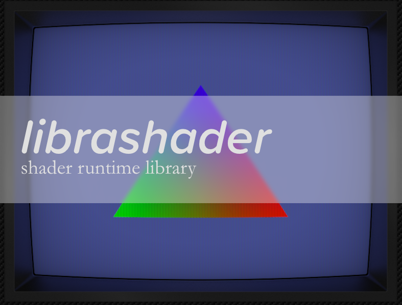

librashader is a complete reimplementation of the RetroArch slang shader pipeline that allows standalone emulators to easily and **optionally** implement support for RetroArch-style shaders and shader presets.

I've been sitting on this for a while since the last [Snowflake progress report](https://snowflakepowe.red/blog/progress-report-2022-03-02) where I teased it at the very end, but it wasn't until a few months ago that I nerd sniped myself into investigating the feasibility of doing so. The end result of this effort is a complete reimplementation of a shader pipeline that should be compatible with all shaders in [slang-shaders](https://github.com/libretro/slang-shaders), including the preset parser, the shader preprocessor, and SPIR-V translation, as well as runtime implementations for Direct3D 11, OpenGL, and Vulkan. To be clear, librashader did not "rip out" the shader parts of RetroArch, but is a complete reimplementation with a [fully documented Rust API](https://docs.rs/librashader/latest/librashader/) that exposes every part of the pipeline. 

## Why do this?

Besides being an opportunity for myself to learn more about graphics APIs, the main goal of Snowflake has always been to provide a seamless experience to the user, without increasing maintenance burden on developers. This is a rejection of the "core" based philosophy where developers have to maintain a separate fork of their emulator to service
an API which may fit the emulated console like a square peg does a round hole. Instead, Snowflake's approach is to contort itself into whatever shape some standalone emulator
requires, going so far as to compile configuration files, and (in the future) perform live editing of emulated memory. 

That isn't to say that the "core" based philosophy does not have upsides. RetroArch's excellent shader system is often praised by users for its excellent visual quality, and
compatibility across cores of many emulated systems. To do some things well, you really do need to reach into the code, and hacking around the issue like Snowflake attempts to do
will only get you so far.

However, that does not mean that an emulator needs to "core"-ify itself to support RetroArch shaders! librashader brings the power of RetroArch shaders to any program that can render an image to a buffer offscreen. All the emulator has to do, at the very end right before a frame is presented, is to call into a librashader runtime to apply shader passes,
and now **any emulator** can use RetroArch's shaders, without needing to be a RetroArch core.

## How does librashader work?

  
   
  <em style="font-style: italic;font-size:14px;">The OpenGL 4.6 runtime running gbc-lcd-grid-v2. My example apps are very basic and the poor scaling and rendering outside the borders is due to poor handling of the viewport, not the librashader runtime.</em>

librashader implements the [preset parser](https://docs.rs/librashader/latest/librashader/presets/index.html), which parses `.slangp` presets, the [shader preprocessor](https://docs.rs/librashader/latest/librashader/preprocess/index.html), which handles combining multiple shader files into one unit, which can finally be sent to [shader reflection](https://docs.rs/librashader/latest/librashader/reflect/index.html), which actually deals with how to compile the shader for your GPU. This compiled artifact is then sent to a runtime, which deals with rendering the shader given input and output frame buffers.

While Rust is nice, it unfortunately is not in wide use in the emudev community. But since librashader is a Rust library, it can easily provide C exports for integration in C and C++ projects, which the majority of popular emulators are written with.

To make things **as painless as possible** for emulator developers, librashader is distributed as a dynamic library intended to be loaded at runtime. [A header-only C loader (`librashader_ld.h`)](https://github.com/SnowflakePowered/librashader/tree/master/include) is designed to be copy and pasted into your project, which loads librashader function pointers from an implementation (i.e. `librashader.dll` or `librashader.so`). If no implementation is found, then the loader will do nothing when the functions are called. Complete documentation is provided for both the [C bindings](https://docs.rs/librashader-capi), and the [native Rust API](https://docs.rs/librashader). 

I don't want to prevent commercial, permissively licensed, or closed source projects from using librashader, but I also want to encourage contributions to come back to the project. To that end, the *implementation* of librashader is licensed under the Mozilla Public License 2.0, whereas the C headers (and only the headers) including `librashader_ld.h` are licensed under the MIT license. This allows librashader to be used in commercial, permissively licensed, and closed source projects, so long as any modifications are open sourced and make it back to the community, while staying non-viral. 
 
## Caveats
The biggest caveat is of course that librashader still requires support from emulator developers, and I do not want to force anyone's hand via hostile forks or otherwise less-than-polite encouragement. Code changes will be needed to bring in librashader, and while I have designed the library to be as non-invasive as possible, such code changes may not be trivial. For any developers that are interested, please reach out to me via GitHub or [Twitter](https://twitter.com/chyyran) if you encounter any bugs or issues while exploring librashader. 

librashader supports less platforms than RetroArch does. I do not have a personal macOS device to develop a Metal runtime for, and developing the Vulkan runtime was a month-long slog for me, having known next-to-nothing about Vulkan, which has left me too burnt out to touch a Direct3D 12 runtime at the moment. I hope to revisit D3D12 soon in the future after switching gears and taking a break.

There are some additional technical caveats listed in the [readme](https://github.com/SnowflakePowered/librashader/blob/master/README.md) that is more helpful for developers, but I don't forsee any actual issues in practice outside of any actual bugs that come up.

## Future Work
A Direct3D 12 runtime would be nice to have. All the runtimes are fairly similar in structure, so I think I will quite easily be able to support D3D12 soon but I do need to take a break, play some actual video games, and touch grass. I had originally planned to release this by Christmas, but the Vulkan runtime was taking me so long to find the motivation to complete. 

In the further future, I am hoping to move the shader compiler and reflection infrastructure from [SPIR-V Cross](https://github.com/grovesNL/spirv_cross) and [shaderc](https://github.com/google/shaderc-rs), which are Rust bindings to C++ libraries, to [naga](https://github.com/gfx-rs/naga), which is written in pure Rust, and [much faster than SPIR-V Cross](https://gfx-rs.github.io/2021/05/09/dota2-msl-compilation.html) in shader translation and reflection, meaning shorter load times for shaders. Moving to naga could possibly bring support to a possible WebGPU runtime. There are also talks to emit DXBC/DXIL completely, bypassing FXC/DXC in HLSL compilation. However, this is currently blocking on [combined image sampler support](https://github.com/gfx-rs/naga/issues/1012) on GLSL parsing and lowering to shader languages that don't support combined image samplers like HLSL. 