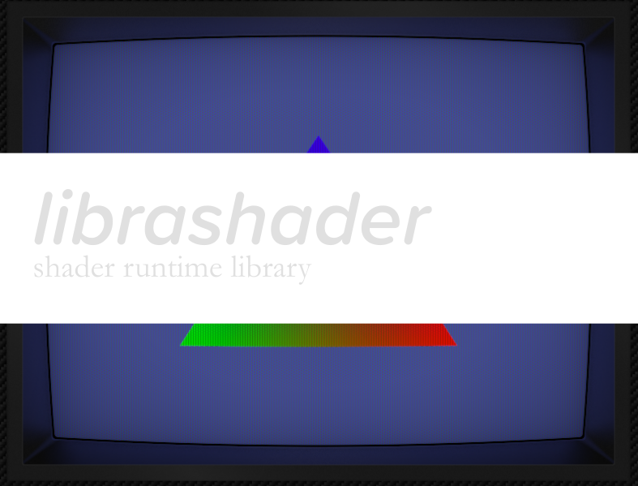
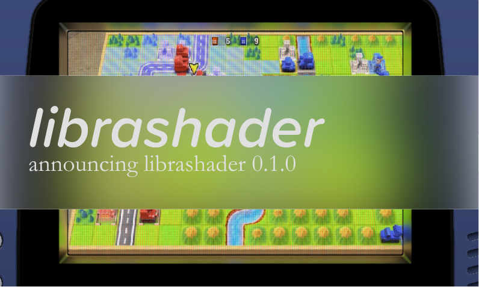
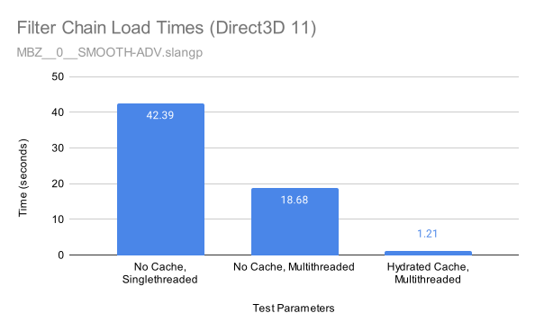
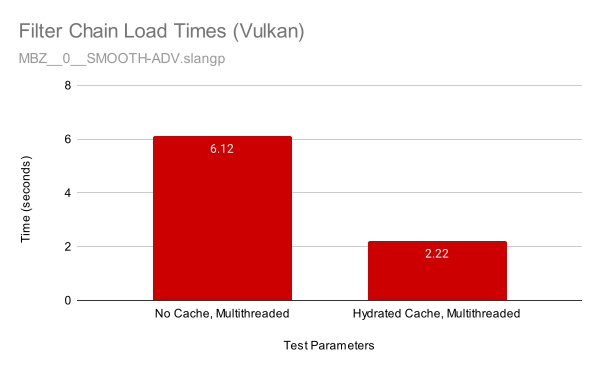

<!--  -->

  
   
  <em style="font-style: italic;font-size:14px;">I don't remember Advanced Wars looking that good on GBA.</em>

A little over a month ago I unveiled [librashader](https://github.com/SnowflakePowered/librashader), a standalone shader runtime for RetroArch 'slang' shaders in [this blog post](https://snowflakepowe.red/blog/introducing-librashader-2023-01-14). I've been blown away by the positive response and in the end couldn't keep away at polishing and tackling some of those "Future Work" items I alluded to at the end. With all the bugfixes and new features this month, I'm happy to announce the first numbered release of librashader, version 0.1.0, bringing it officially out of beta. 

The new release includes a ton of bugfixes to correct rendering accuracy as well as host of new features that try to make librashader a "*better-than-reference*" implementation of RetroArch's [slang-shader](https://github.com/libretro/slang-shaders) runtime; features like a working Direct3D 12 implementation, multithreaded shader compilation, and a persistent global shader cache. librashader 0.1.0 also begins a commitment to [semantic versioning](https://semver.org/)
of the library as well as an [explicit versioning policy](https://github.com/SnowflakePowered/librashader#versioning) for C ABI compatibility. 

Before anything gets out of hand, the hero image is just a screenshot of the Advanced Wars remake running [Duimon's GBA Mega Bezel preset](https://forums.libretro.com/t/duimon-hsm-mega-bezel-graphics-and-presets-feedback-and-updates/28146) on the Direct3D 11 test program, for illustrative purposes only.

## Direct3D 12 Runtime

  
   
  <em style="font-style: italic;font-size:14px;">Mega Bezel SMOOTH-ADV-GLASS on DirectX 12.</em>

In the last blog post, I said something along the lines of "D3D12 should be pretty easy to add support for". Instead, adding D3D12 support sent me down an even deeper rabbit hole than Vulkan or any other runtime ever did. I'm **really** proud of the end result; to explain a little bit more, let's take a look at how `crt-royale` looks like on RetroArch today.

  
   
  <em style="font-style: italic;font-size:14px;">That doesn't look right.</em>

When writing a new runtime, I generally begin my journey at looking at what is "correct" output in RetroArch's image display. Unfortunately, RetroArch's Direct3D 12 driver seems to be extremely broken. I wasn't even able to debug it with RenderDoc because it would just crash whenever it tried to hook the process. 

Despite that, I forged on and hoped for the best. By this point I had three different runtimes to compare with, and [a collection of abstractions](https://docs.rs/librashader-runtime/latest/librashader_runtime/) that I knew *had* to be correct for any graphics API, so I started off with translating parts of the Direct3D 11 runtime into Direct3D 12, referencing the Vulkan runtime whenever certain parts in the API needed a more "Vulkan-y" approach. Each runtime does basically the same things, in the same order, just with a different way of doing so.

Generating mipmaps in D3D12 was one of the things that were done **very** differently than in any other of the runtimes. While OpenGL, Direct3D 11, and Vulkan all have ways to issue commands from the CPU to the GPU to tell it to generate a mipmap chain (Vulkan is a little more low-level but `vkCmdBlitImage` in a loop is close enough), Direct3D 12 requires the use of a compute shader. RetroArch uses a [custom written mipmap shader](https://github.com/libretro/RetroArch/blob/master/gfx/drivers/d3d_shaders/mipmapgen_sm5.h) to generate these, but it was important for me that librashader remain MPL 2.0 compatible, so I couldn't use this code. Instead, Microsoft provides [an MIT licensed mipmap shader](https://github.com/microsoft/DirectXTK12/blob/main/Src/Shaders/GenerateMips.hlsl) that comes with no documentation or usage examples. Having never used the Direct3D 12 API before, it was a bit of a struggle to figure this out.

  
   
  <em style="font-style: italic;font-size:14px;">crt-royale on librashader Direct3D 12.</em>

I eventually got everything working, and to my surprise, `crt-royale` loaded and displayed somewhat correct output. When testing other shaders though, it soon became apparent that something was wrong because my test program would refuse to load some shaders. It turns out that SPIRV-Cross, which is the library RetroArch and librashader uses to translates 'slang' (Vulkan GLSL) into HLSL for Direct3D 11 and 12, [has problems with how some shaders are written](https://github.com/KhronosGroup/SPIRV-Cross/issues/1611); despite that, it mostly works out alright for Direct3D 11. Direct3D 12 however, is a lot stricter and will straight up refuse to run the shader if everything isn't ✨perfect✨, so shaders that run into this issue will just not load at all. These shaders also refuse to load in RetroArch's Direct3D 12 driver as well.

  
   
  <em style="font-style: italic;font-size:14px;">crt-lottes fails to load with RetroArch's Direct3D 12 driver.</em>

Thanks to the folks on the DirectX discord, I learned about [spirv-to-dxil](https://gitlab.freedesktop.org/mesa/mesa/-/blob/main/src/microsoft/spirv_to_dxil/spirv_to_dxil.h), which could translate SPIR-V (the bytecode version of the shaders) directly to DXIL, which is the bytecode format that Direct3D 12 understands. Before, the D3D12 runtime had to go through a conversion from GLSL, to SPIR-V, to HLSL, *then* to DXIL. This resulted in me having to shave a yak for a couple of days to write [Rust bindings to spirv-to-dxil](https://crates.io/crates/spirv-to-dxil). Since spirv-to-dxil is a smaller part of a **huge** graphics library called [Mesa](https://en.wikipedia.org/wiki/Mesa_(computer_graphics)), this mostly involved figuring out how to build as little of Mesa as possible to not bloat librashader too much.

The end result being that the shaders that were broken before with SPIR-V Cross could now load in librashader! However, while spirv-to-dxil seemed like a really great solution, it didn't work for everything. Some shaders that would load with the SPIR-V Cross HLSL pipeline, no longer loaded with spirv-to-dxil.

The problem turned out to be an issue with "linking" shaders together. It's a bit too technical for this blogpost but basically the compiler sometimes doesn't have enough information to properly compile the shader. However, in those cases, SPIR-V Cross mostly seemed to just happen to work for whatever reason. While I was assured that eventually the linking step would be exposed to library consumers, I wasn't going to wait for that to happen. In the end, I went with the *incredibly cursed* option of [just trying both and seeing what works](https://github.com/SnowflakePowered/librashader/blob/2adb23c01f553a390f197a2787f502616d7e13c7/librashader-runtime-d3d12/src/filter_chain.rs#L402). If spirv-to-dxil fails, then it will fall back to SPIR-V Cross. If even that fails, then the shader won't be able to load, but I fortunately in my testing I haven't encountered this situation yet. In the future as spirv-to-dxil improves, I hope to be able to remove the SPIR-V Cross HLSL pipeline from the D3D12 runtime entirely.

Note that the Direct3D 12 runtime requires [`dxil.dll`](https://github.com/microsoft/DirectXShaderCompiler/releases) to be available.

## Multithreaded Shader Compilation and Thread Safety Improvements

librashader being written in Rust makes it almost trivial to allow shaders to compile on multiple threads. On Direct3D 11, Direct3D 12, and Vulkan, shaders and graphics pipelines are now compiled with multiple threads if possible. 
Note that this only applies to the final compilation of shaders at the driver level; 
reflection via SPIR-V Cross is still single-threaded because SPIR-V Cross is fast enough that the overhead of multiple threads is probably more than the speed gains. Heavy shaders with a ton of passes will definitely see a noticeable speed-up when loading a shader preset.

Loading LUT images into CPU memory is also now done with multiple threads. This is also available to OpenGL as well as Direct3D 11, Direct3D 12, and Vulkan, and substantially speeds up load times post-compilation.

There were also API improvements in allowing filter chains to be built asynchronously in a different thread. A lot of this involved shoring up various internal datastructures to make sure they were thread safe to read from separate threads, but the biggest addition are the new `filter_chain_create_deferred` APIs that allow
the caller to defer GPU-side initialization of the filter chain until after all the CPU work is done in a different thread. Properly utilized, loading a new shader preset should not "lock up" the emulator or game.

## Shader Caching ([#10](https://github.com/SnowflakePowered/librashader/pull/10))

Heavy shaders with a lot of passes take incredibly long to load, particuarly for Direct3D 11 which relies on the [old and slow FXC shader compiler](https://twitter.com/aras_p/status/1397093065756745730). Multithreading
shader compilation already helps a lot, but I still wasn't satisfied with load times on certain shaders.

Caching shaders is a technique used by a lot of emulators that need to compile a lot of shaders on the fly to reduce stutters. librashader can use the same technique to bring a substantial load time decrease when the cache is properly hydrated.

  
   
  <em style="font-style: italic;font-size:14px;">Direct3D 11 sees substantial improvements from bypassing FXC.</em>

Loading the Mega Bezel Smooth shader goes from 42 seconds with singlethreaded shader compilation, to around 18 seconds without caching with just multithreading, to a mere **1 second load time** on load with a hydrated cache. 
Other runtimes like Vulkan, OpenGL 4.6, and Direct3D 12 also benefit from caching SPIR-V artifacts, driver-specific compiled programs, and pipeline state objects, albeit not as much as Direct3D 11 as they were already plenty fast.

  
   
  <em style="font-style: italic;font-size:14px;">3X load time decrease by caching Vulkan pipeline caches.</em>

librashader's shader cache is global, meaning that every program that uses librashader will benefit from the same shader cache. Programs that use librashader don't have to do anything special to use the shader cache as its enabled by default, but it can be disabled at runtime with a configuration flag. Updating driver versions or switching GPUs will automatically evict old entries and recompile the shader object or pipeline. 

Combined with deferring GPU-side initialization, these improvements make it possible for librashader to load shader presets extremely fast and completely without the long pauses it sometimes takes to load a shader in RetroArch.

## Improved Rendering Accuracy and Bugfixes

There have been a bunch of improvements to rendering accuracy to be more in line with RetroArch (i.e. more correct)  since the beta release last blog post.

* [`dffea95`](https://github.com/SnowflakePowered/librashader/commit/dffea953707fd0a04dac5eb4cee9826712d6ca09) The restriction on only allowing a uniform to be bound to *either* the UBO or push constants has been lifted. This was causing problems for shaders that bound a uniform to the UBO in the vertex shader, but a push constant in the fragment shader, causing inaccurate rendering or just refusing to load.
* [`92caad2`](https://github.com/SnowflakePowered/librashader/commit/92caad292c33ada5f1cf4b7d71cdf699634a8c3f) Output framebuffers were not correctly scaled and caused a lot of shaders to have incorrect output if the source image size was different from the output image size. With this fix, `crt-royale` goes from looking [absolutely horrifying](https://user-images.githubusercontent.com/109876913/215313100-0d0f228a-b89d-4d45-a0c8-f01c83d4b98c.png) to [what it's supposed to look like](https://user-images.githubusercontent.com/1000503/215374744-0f2f668e-9dd2-4150-8d90-663d91ebcfc4.png). In hindsight, I should have caught this because [this is how gbc-lcd-grid-v2 is supposed to look](https://user-images.githubusercontent.com/1000503/217715963-84a36294-3d66-4007-86ff-21f613f9bc4f.png), and not whatever [this was](https://user-images.githubusercontent.com/1000503/212462721-f40f3555-8c50-448e-8876-534102f982e1.png), which I thought was a result of poor viewport handling. The triangle is clipped because the source image is too big for what the shader expects, but that is the proper behaviour.
* [`5ffcf00`](https://github.com/SnowflakePowered/librashader/commit/5ffcf005a0920c9e2166078ddc9d677cc48f4492) D3D11: The blend state wasn't set properly in Direct3D 11 so some shaders would just render a black texture.
* [`3c15a3a`](https://github.com/SnowflakePowered/librashader/commit/3c15a3a523452c3679b0c9bbbbf5f277dd07fac0) The number of frames required for history wasn't calculated properly, so shaders that used history would have corrupt or no output.
* [`6cb2859`](https://github.com/SnowflakePowered/librashader/commit/6cb28590585cd8989a995b2f93b2205ae4734663) Filter passes with unspecified filters should default to nearest neighbour rather than linear filtering.
* Direct3D 11, 12, and Vulkan now use the identity MVP with to render intermediate passes. This should make rotation easier to deal with and more closely matches RetroArch's behaviour.

Thanks to [@star69rem](https://github.com/star69rem) for helping me find most of these inaccuracies.

These bugfixes and QOL improvements should help with anyone wanting to use librashader in their project.

* [`43b7d6f`](https://github.com/SnowflakePowered/librashader/commit/43b7d6fb5399f6e3000e89016cdb299f2c012b48) Add support for reading shader source files encoded in [Latin-1/Windows-1252](https://en.wikipedia.org/wiki/Windows-1252) rather than UTF-8.
* [`3db89e5`](https://github.com/SnowflakePowered/librashader/commit/3db89e5351a7a2bb5caa5a12c62c6c150b68a21d) The quad VBO is bound only once per frame rather than per-pass for improved performance.
* [`48a1b28`](https://github.com/SnowflakePowered/librashader/commit/48a1b28665d6a18403a14cea813324e66f9e9816) Path resolution logic in the preset parser was fixed and a bunch of hacks were added to better support certain presets.
* [`e2e6357`](https://github.com/SnowflakePowered/librashader/commit/e2e6357cfb4a13adac882dc579927ecb695395d9) Parse referenced presets depth-first to better support overriding parameters.
* [`c5b2b50`](https://github.com/SnowflakePowered/librashader/commit/c5b2b50d16c496aeb677e81e6c770e27737ad471) D3D11: Disable CPU access by default on textures to improve performance.
* [`fb827b7`](https://github.com/SnowflakePowered/librashader/commit/fb827b7c24edc64e69c0a96b3b6e462b7dca1048) Vulkan: Optional support for environments without dynamic rendering support. [`VK_KHR_dynamic_rendering`](https://registry.khronos.org/vulkan/specs/1.3-extensions/man/html/VK_KHR_dynamic_rendering.html) is no longer required, but is still recommended if possible. Without dynamic rendering, graphics pipelines will be recompiled if the output format changes.
* [`009e740`](https://github.com/SnowflakePowered/librashader/commit/009e74061078a6c573aee8dd67424f2d599e4622) Vulkan: Memory is now managed with [gpu-allocator](https://github.com/Traverse-Research/gpu-allocator) rather than creating a buffer for each new texture. This should reduce the number of Vulkan buffer allocations that librashader takes up in an application.
* Lots of soundness fixes and improvements to the C API headers. 
* Lots of cleanup and refactoring of common code to make sure behaviour is as close as possible in all runtimes. If anyone ever wants to take a shot at a Metal runtime, take a look at the [librashader-runtime crate](https://docs.rs/librashader-runtime/latest/librashader_runtime/).

## Next steps

This 0.1.0 release stops short of a "1.0" release in terms of a full commitment to a stable API, but I'm satisfied with the current state of things and hope that I have everything in place to allow librashader minimize the chance of needing to break API or ABI. The changes made to the C headers since the last blog post should hopefully be sufficient to allow librashader to evolve and add new features while maintaining backwards compatibility; and in the worse case, safely refuse to load in the chance of an ABI incompatibility. I've put a lot of thought into being able to integrate librashader in a project safely, cleanly, and easily; making sure that updates are done in a compatible manner is one of the most important things to consider.

There are a couple of performance improvements I want to pursue eventually. As stated before, switching to [naga](https://github.com/gfx-rs/naga) is a long term goal that requires upstream changes to support some features we need. If this ever comes to fruition, a WebGPU runtime would be right around the corner. There's also a [SPIR-V to DXBC compiler](https://gitlab.freedesktop.org/mesa/mesa/-/merge_requests/14253) PR in Mesa that could help to improve initial Direct3D 11 build times and get rid of FXC, but I've spoken to the author and it doesn't seem that it will be brought into tree very soon. All this can be done without breaking the current ABI. The shader cache also provides enough of a speedup that these improvements aren't as important as they would be without, only improving load times on fresh shader compiles, but there's always room for improvement.

The other improvements I could think of are the logging API I wrote briefly about as well as possibly [more descriptive error strings](https://github.com/SnowflakePowered/librashader/blob/master/librashader-capi/src/error.rs), but those are not really exciting to write about or work on, and I think the current state of the library is plenty usable and ergonomic even without. 

For the time being though, I've accomplished most of my short term goals with librashader and plan to let it bake a little, bugfixes notwithstanding. If or when it gains some more adoption, I'll look into seeing what tweaks (if any) it needs to release a proper 1.0 version and commit long term to a stable API. 

As always, feel free to reach out via [GitHub](https://github.com/SnowflakePowered/librashader) if you have any questions or trouble regarding using librashader in your project.

