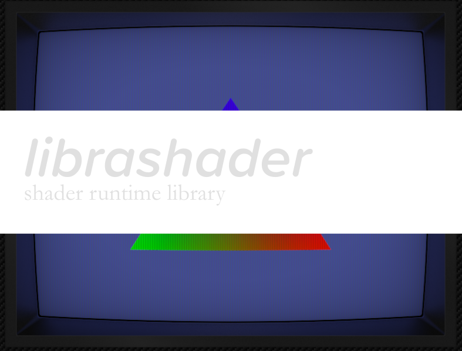
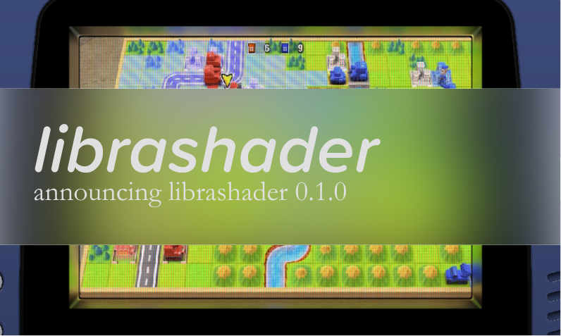

<!--  -->

  
   
  <em style="font-style: italic;font-size:14px;">I don't remember Advanced Wars looking that good on GBA.</em>

It's been a little over a year since librashader was released and while I've had lots of positive feedback, this release hopes to address the concerns I've received regarding its developer experience, both for Rust, and C API usage. There haven't been really any new huge features since last year (besides support for the new [RetroArch preset path wildcards](https://github.com/libretro/RetroArch/pull/15023)), but there's been a host of improvements towards its build-time requirements, distribution, and a entire new runtime.

## `wgpu` Runtime
librashader now provides a [`wgpu`](https://github.com/gfx-rs/wgpu) runtime, currently only available in the Rust API. This will allow developers writing `wgpu` applications to more easily integrate librashader into their rendering pipelines. 

There were considerable technical difficulties to bringing this all-new runtime to librashader. While it is an 'abstraction layer' over native graphics APIs, it only natively supports the WGSL shader language. WGSL does not support combined "texture samplers", (`sampler2D`) but this is a [requirement of the slang-shader spec](https://github.com/libretro/slang-shaders?tab=readme-ov-file#deduce-shader-inputs-by-reflection). The solution is to write a [custom compiler pass](https://github.com/SnowflakePowered/librashader/blob/master/librashader-reflect/src/back/wgsl/lower_samplers.rs) that runs after the shader files have been parsed, to "lower" or split apart textures and samplers so they can be recompiled to WGSL. 

librashader on `wgpu` runs on all native platforms, including macOS. `wgpu` also runs on WebGPU, but there are some issues with linking to some C libraries that librashader requires that prevent it from currently building for the web, but they are by no means insurmountable issues. 

## Preset path wildcard replacements

This implements a Rust and an ABI-compatible C API for loading presets with RetroArch path wildcards

## Remove nearly all build-time dependencies
This release places a large focus on removing build-time dependencies for librashader. I'm now proud to say that librashader now only needs a moderately recent Rust compiler and a C toolchain to build. I've done this by removing build-time dependencies from `spirv-to-dxil` and switching from `shaderc` to `glslang`.

`shaderc` is a wrapper around `glslang`, which is used to compile shader GLSL files into SPIR-V for use in various librashader runtimes. RetroArch uses `glslang` directly when compiling these shaders, but for a long time the only solution for Rust was the [shaderc](https://crates.io/crates/shaderc) crate. Unfortunately, shaderc has a build-time dependency on Python and CMake, which slowed down the compilation process and required build machines to install Python. After dealing with the quirks of building `shaderc` for a very long time, I decided to bite the bullet and write [bindings to the C API for `glslang`](https://github.com/SnowflakePowered/glslang-rs). Combined with [removing the meson dependency](https://github.com/SnowflakePowered/spirv-to-dxil-rs/pull/5) on `spirv-to-dxil-rs`, librashader now builds with only a Rust compiler, a C toolchain and no external dependencies. 

Not even `libvulkan` is needed now&mdash;a sneaky feature flag had been enabled in the Vulkan runtime that caused `librashader.dll` to need to link with the Vulkan SDK; this flag was removed and now librashader can build on environments without `libvulkan` present.

## Linux packages
librashader now provides packages for [a variety of Linux distributions](https://software.opensuse.org//download.html?project=home%3Achyyran%3Alibrashader&package=librashader) across various architectures. I hope this will make using librashader on Linux a little easier for end users and developers. Unfortunately, as Debian Bookworm's `rustc` is still stuck on 1.63, which is over a year and a half old, I am only able to provide Debian packages for users on Debian Testing. Thankfully librashader does build on Ubuntu 23.10 and Fedora 39, both of which ship relatively recent versions of `rustc`.

## Next steps

I'm quickly coming up to the limit of ideas with librashader, but I'm thankful for the learning experiences it's provided me along the way. `wgpu` opens up the possibility of librashader on the web, and while I currently don't have a personal macOS computer to develop on, it seems I have a chance to obtain one this year, opening up a Metal runtime for librashader (of course, PRs are definitely welcome). I hope these updates will make things even easier for developers to integrate slang shader presets to their games and emulators.
