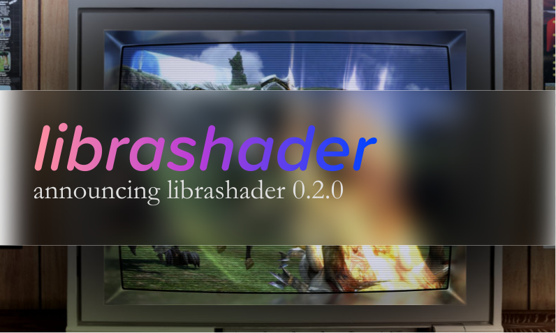
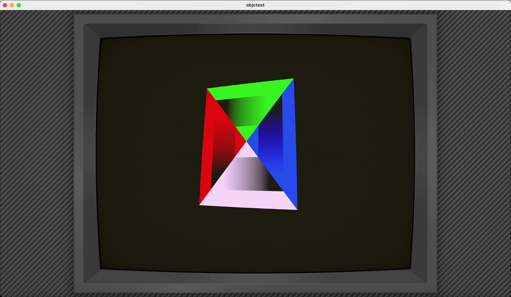

  
   
  <em style="font-style: italic;font-size:14px;">Final Fantasy XIII technically did release while CRTs were still common.</em> 
  <em style="font-style: italic;font-size:12px;">Preset: koko-aio Ambilight Immersive</em>

It's been a almost exactly a year since librashader was released and while I've had lots of positive feedback, this release hopes to address the concerns I've received regarding its developer experience, both for Rust, and C API usage. This release of librashader finally brings complete reference parity with RetroArch
slang shaders with two brand new runtimes, support for [preset path wildcards](https://github.com/libretro/RetroArch/pull/15023), and support for new shader semantics added to RetroArch since last year.

## Full macOS and Metal support

<video autoplay loop muted playsinline width="800" style="width:100%;">
  <source src="cube.mp4" type="video/mp4; codecs=hvc1">
  <source src="cube.h264.mp4" type="video/mp4; codecs=avc1">
   tag">
</video>
   
  <em style="font-style: italic;font-size:14px;">The default Xcode Metal template, now with 100% more bezels.</em>

librashader was primarily focused on Windows and Linux, and it wasn't until recently that I was able to get my hands on a macOS machine to be able to do some basic testing. This release of librashader brings full macOS support by [fixing a bug in the OpenGL runtime](https://github.com/SnowflakePowered/librashader/pull/44) that prevented shaders from running on macOS, as well as an [entirely new Metal runtime](https://github.com/SnowflakePowered/librashader/pull/38) that is [fully compatible with Objective-C](https://github.com/SnowflakePowered/librashader/blob/master/test/capi-tests/objctest/objctest/Renderer.m). With the addition of the Metal runtime, librashader is now able to run on all modern desktop environments. 

After completing the (also new) wgpu runtime with minimal rendering bugs, I became convinced that I could write a fully working Metal runtime for librashader without needing a lot of testing. This was a moment of hubris: I was fortunately able to borrow a friend's MacBook Pro for a couple of days to iron out one or two bugs, as well as writing a quick Objective-C example to test the validity of the C bindings. Still, thanks to the many common abstractions behind each librashader runtime, I was able to hammer out most of the Metal runtime in a little less than 4 days, with a couple of days extra to debug.

The Metal runtime is written completely in Rust, mostly on a Windows environment. Since I still don't have easy access to a macOS machine, testing will have to rely on users and developers on macOS. It also does not support shader caching at the moment, but it seems shader compilation on Apple Silicon machines is fairly fast. The Metal runtime supports both Intel Macs and Apple Silicon, as well as iOS if you build your own binaries.

A huge thanks to [@LukeUsher](https://github.com/LukeUsher) for kicking off this effort by [setting up CI builds for macOS](https://github.com/SnowflakePowered/librashader/pull/36) and testing the OpenGL runtime on macOS.

##  wgpu runtime 

librashader now provides a [`wgpu`](https://github.com/gfx-rs/wgpu) runtime, currently only available in the Rust API. This will allow developers writing `wgpu` applications to more easily integrate librashader into their rendering pipelines. 

   

There were considerable technical difficulties to bringing this all-new runtime to librashader. While it is an 'abstraction layer' over native graphics APIs, it only properly supports the WGSL shader language, which does not support combined "texture samplers", (`sampler2D`) but this is a [requirement of the slang-shader spec](https://github.com/libretro/slang-shaders?tab=readme-ov-file#deduce-shader-inputs-by-reflection). The solution is to write a [custom compiler pass](https://github.com/SnowflakePowered/librashader/blob/ba6c32e8587be7f96297b64e70e8a830de452b26/librashader-reflect/src/reflect/naga/spirv_passes/lower_samplers.rs) that runs after the shader files have been parsed and compiled into SPIR-V bytecode, to "lower" or split apart textures and samplers so they can be recompiled to WGSL. This was the biggest blocker to writing this backend, and having now written this lowering pass, it opens up whole new options for librashader to eventually switch completely to [naga](https://github.com/gfx-rs/wgpu/tree/trunk/naga) for shader transpilation over SPIRV-Cross.

There are some caveats, especially compared to some other shaders. wgpu does not support any shaders that use the [inverse function](https://github.com/gfx-rs/wgpu/issues/4330), this includes Mega Bezel shaders. wgpu also does not support shader caching in any way. While `wgpu` works on the web through WebGPU, librashader currently uses some C dependencies like glslang that prevent it from building, which means it only runs on native platforms. This is not an insurmountable issue however, and I hope to see librashader in browsers in the future.

Thanks to [@dbalsom](https://github.com/dbalsom) for requesting this runtime for his [MartyPC](https://github.com/dbalsom/martypc) emulator, and [@eddyb](https://github.com/eddyb) for helping me figure out some of the more difficult SPIR-V transforms.

## Preset path wildcard replacements

librashader now supports loading presets with [shader preset path wildcards](https://github.com/libretro/RetroArch/pull/15023), from both the Rust and the C API. Presets can now be created with a context object that can map wildcard strings like `$VID-USER-ROT$` with the value of your choice. All wildcards supported by RetroArch are also supported by librashader, and you can even have [custom wildcards](https://docs.rs/librashader/0.2.0-rc.2/librashader/presets/context/enum.ContextItem.html). This should bring enhanced support for some of the Mega Bezel shaders that rely on these wildcards to provide a better experience for users.

## New shader semantics and scaling options

librashader now supports the [`Rotation`](https://github.com/libretro/RetroArch/pull/15136), [`CurrentSubFrame`, and `TotalSubFrames`](https://github.com/libretro/RetroArch/pull/16209) semantics introduced fairly recently. Shader presets using these uniforms will now be supported, if the program calling into librashader supplies it with the information. As librashader just handles applying effects to a quad texture, applications that use librashader will need to supply it with the relevant and correct values to take advantage of these features.

The new [`original`](https://github.com/libretro/RetroArch/pull/15937) scaling type, still in draft, is also now supported by librashader. This PR has yet to land in RetroArch, so no shader presets currently use this scaling type, but when it lands, librashader will correctly handle scaling for presets that use this scale type.

## Build and portability improvements

This release placed a large focus on making librashader easier to build, on more platforms. The build-time requirements for librashader 0.1.0 used to require Python, CMake, and some more tooling due to upstream dependencies. After much effort on improving or replacing those dependencies, librashader now only needs a fairly recent Rust compiler, and a C toolchain to build.

This was done by bypassing Meson for `spirv-to-dxil` and replacing the shader compiler with [new bindings directly to `glslang`](https://crates.io/crates/glslang). Glslang is a compiler used to compile the shader source files, which are written in GLSL, to SPIR-V, which is then converted back into a variety of different
shader formats for each runtime. While RetroArch uses glslang directly, for many years [`shaderc`](https://crates.io/crates/shaderc) was the only solution for Rust. Shaderc is a wrapper around glslang written by Google, but included many features not used by librashader. Many of librashader's non-Rust build requirements came from Shaderc, and with its removal, these build requirements are no longer required.

The buildtime dependency on `libvulkan` was also removed. A sneaky feature flag that had been enabled in the Vulkan runtime caused `librashader.dll` to need to link with the Vulkan SDK; this flag was removed and now librashader can build on environments without `libvulkan` present.

librashader now no longer ships an extra copy of SQLite for caching, which should also help with statically linked environments. The shader cache is now backed by [persy](https://docs.rs/persy/1.4.7/persy/index.html), which is a pure-Rust persistence key-value store. This means that updating librashader will invalidate existing shader caches, but persy should be a tiny bit faster than SQLite when saving and restoring shaders (although SQLite was already plenty fast).

## Linux packages

librashader now provides packages for [a variety of Linux distributions](https://software.opensuse.org//download.html?project=home%3Achyyran%3Alibrashader&package=librashader) across various architectures. I hope this will make using librashader on Linux a little easier for end users and developers. librashader provides packages on Arch,Ubuntu 23.10 and Fedora 39, all of which ship relatively recent versions of `rustc`. Unfortunately, as Debian Bookworm's `rustc` is still stuck on 1.63, which is over a year and a half old, I am unable to properly support Debian until they upgrade their Rust compiler to 1.70 or higher. 

As librashader no longer has buildtime linkage requirements, the binary packages are standalone and do not pull in any dependencies. Source packages require `cargo`, `gcc` and `patchelf` (to update the SONAME), but no other external libraries or build tooling. 

## Next steps

With the completion of the Metal and wgpu runtimes, librashader brings slang-shader support to every modern graphics API. The only remaining frontier is WebGPU support, which would involve adding [emscripten](https://emscripten.org/) bindings to glslang-rs. There are also some ecosystem challenges with WebAssembly, so as the WebAssembly environment matures, I'll be sure to bring librashader along with it although how long that will take is anyone's guess. 

I would also like eventually allow a fully pure-Rust shader compilation pipeline. While in theory naga would be able to replace both glslang, its GLSL parser as well as its output are not as mature as glslang and SPIRV-Cross&mdash;this is the main reason why complex shaders don't work with the wgpu backend. It will take some more time in order to bring a full Rust dependency chain to librashader.

Of course, I intend to fix bugs as usual, as well as keep up with new shader features released by RetroArch. librashader's [runtime abstractions](https://docs.rs/librashader-runtime/latest/librashader_runtime/) means that the work to add new semantic uniforms and features only have to be done once. However, with this release I expect things to slow down quite a lot, as I consider librashader pretty much feature complete. I hope that with the addition of macOS support and the improvements to the build-time experience, developers will now find it easier than ever to bring slang-shaders to their games and emulators. 

As for Snowflake, it's a marathon not a sprint. In the background I've been slowly working on [bindings to WinFSP](https://github.com/SnowflakePowered/winfsp-rs), which will power the next-generation [virtualized filesystem *aincradfs*](https://github.com/SnowflakePowered/aincradfs) for Snowflake. aincradfs will enable true filesystem projection and allow for advanced scenarios such as on-the-fly ROM-hack patching, automatic DLC installation, and better support for save data, especially for modern systems like PS3 and Nintendo Switch.

You can find [librashader on GitHub](https://github.com/SnowflakePowered/librashader).
