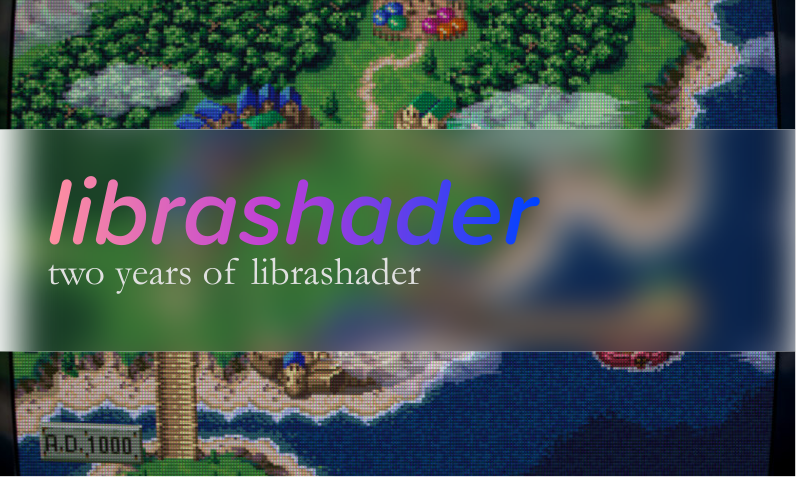
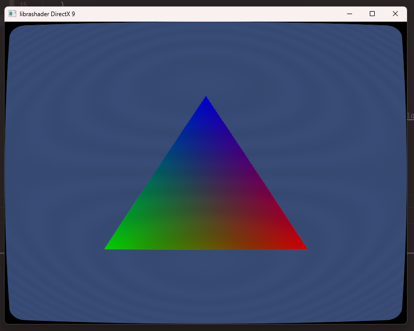

  
   
  <em style="font-style: italic;font-size:12px;">Preset: koko-aio Monitor Bloom Bezel</em>

It's been a year since the release of librashader 0.2.0 and a lot has changed since then. This year has seen a ton of improvements and bugfixes to librashader, thanks to rising adoption in projects like [ares](https://ares-emu.net/). I thought it'd be fun to do another yearly post to summarize what I've been up to with regards to librashader, so let's get started.

## awesome-librashader

This year has seen more projects using librashader so I thought I'd shout them out as well as give a huge thanks. It's always a good feeling to see other projects use your work and wider adoption means more bugs being squashed!

### [ares](https://ares-emu.net/)

ares is probably the most widely known project currently using librashader. A huge thanks to Luke Usher, [jcm93](https://github.com/jcm93), and others in the ares community with helping test librashader compatibility on Metal and other runtimes. Their feedback has been invaluable in refining and improving compatibility with the full set of slang-shaders available.

### [Rio terminal](https://raphamorim.io/rio/)
Rio is a terminal emulator, originally based off alacritty, but now with its own rendering stack based off wgpu. It is an excellent showcase of what librashader's rapidly improving wgpu support can do for all sorts of projects. This is a true successor to cool-retro-term that uses Slang shaders to their fullest.

### [tetsuyu](https://github.com/IsaacMarovitz/tetsuyu)
tetsuyu is a Game Boy emulator, written in Rust, also using librashader's wgpu backend. This is another example of how easy it is to add Slang shaders support to a project.

### [librashader-cli](https://github.com/SnowflakePowered/librashader/blob/master/CLI.md)
Mostly useful for people who write shaders, librashader now comes with a CLI that can be used to apply a shader to an image, do reflection on shader presets, or seeing the converted output of a `.slang` shader to various shader languages. This can be used to debug shaders and shader presets programmatically via `watch`.

## Shader compatibility fixes

Since last year, a ton of work has gone into testing librashader's compatibility with slang-shaders and a huge number of bugs have been uncovered. 

* [#150](https://github.com/SnowflakePowered/librashader/pull/150) Create history images if only one `OriginalHistory` was used.
  * This fixed `mix_frames.slangp` as well as any other shader preset that only used one `OriginalHistory` feedback texture.
* [#127](https://github.com/SnowflakePowered/librashader/pull/127) Fix `#pragma name` and `CurrentSubFrame` being parsed as `TotalSubFrame`
  * `CurrentSubFrame` was just not handled properly at all due to a typo.
  * `#pragma name` was a rare but not unknown shader pragma that lets presets define aliases in the shader file rather than the preset. 
  * This fixes `120hz-smart-BFI.slangp` as well as any shader using `#pragma name`, which wasn't a lot but is still important to support!
* [#125](https://github.com/SnowflakePowered/librashader/pull/125) Implement optionality of the `step` argument.
  * A little known fact about slang shaders is that when defining a parameter, the step argument is actually optional and defaults to 0.02. 
  * This fixes `crt-guest-advanced-ntsc.slangp` and some other test shaders.
* [#117](https://github.com/SnowflakePowered/librashader/pull/117) Draw final pass to `PassFeedback0`.
  * Before this change, librashader would not draw the final pass outputs to the feedback buffers, so shaders that used `PassFeedback0` were inaccurate or straight up did not work.
  * This fixes `crt-geom-deluxe.slangp` and more that use `PassFeedback0`.
* [#71](https://github.com/SnowflakePowered/librashader/pull/71) Load LUT textures with top-left orientation on OpenGL.
  * This change fixes `crt-hyllian.slangp` having odd colours on the OpenGL backend.
* [#85](https://github.com/SnowflakePowered/librashader/pull/81) Cap texture scaling to  [1, 16384].
  * This fixes crashes on Metal when dealing with extremely large or small input or output textures.
* [#112](https://github.com/SnowflakePowered/librashader/pull/112) Update to a newer version of SPIRV-Cross
  * librashader used to rely on an ancient version of [SPIRV-Cross](https://github.com/KhronosGroup/SPIRV-Cross), since it was extremely difficult to update the bindings from SPIRV-Cross's C++ code to librashader's Rust code. 
  * I built an [entirely new set of bindings to SPIRV-Cross](https://github.com/SnowflakePowered/spirv-cross2-rs) using the C API, which is more idiomatic Rust, and much easier to update in the future without worrying about breaking things. This means that librashader can now easily stay up to date with SPIRV-Cross changes.

These changes help with shader compatibility across all runtimes, and since these issues were fixed I have yet to see a shader librashader couldn't handle. 

## wgpu improvements

wgpu support was introduced in librashader 0.2.0 and since then, a lot of work was done both within and outside librashader to bring nearly the full gamut of slang-shaders to wgpu. I'm very proud of the fact that wgpu is now a fully-supported backend alongside the Direct3D, OpenGL, Metal, and Vulkan librashader backends, as well as the work that went into making it happen. The wgpu librashader backend is the first time that slang-shaders are available on a graphics API that RetroArch does not target!

Slang shaders have two stages, a vertex shader which works on the four corners of an input texture, and a fragment shader, which works on each pixel of the input. Fragment shaders can use the outputs of the vertex shader as inputs as well. 

In Vulkan, you can get away with having outputs in the vertex fragment that aren't used as inputs in the fragment shader, and some shaders in the slang-shaders repository abuse this. However, wgpu is very strict and doesn't support this; in fact librashader's wgpu support was initially enabled by a lowering pass on the shader that [converted `sampler2D` to a split `texture2D` and `sampler`](https://github.com/SnowflakePowered/librashader/blob/master/librashader-reflect/src/front/spirv_passes/lower_samplers.rs), since wgpu does not support "combined image samplers". To fix this, librashader runs a [linkage pass](https://github.com/SnowflakePowered/librashader/blob/master/librashader-reflect/src/front/spirv_passes/link_input_outputs.rs) on the shader that removes outputs in the vertex shader that aren't used by the fragment shader. This step also greatly improves Direct3D 12 compatibility since Direct3D 12 is similarly strict about inputs and outputs matching.

There were two more hurdles cleared that brought full wgpu support to librashader. Graphics APIs usually have a native shading language that it works with. Slang shaders work by first using [glslang](https://github.com/KhronosGroup/glslang) to compile GLSL to SPIR-V, a bytecode language, then using [SPIRV-Cross](https://github.com/KhronosGroup/SPIRV-Cross) to convert the SPIR-V back into to various other languages like HLSL for Direct3D. wgpu uses it's own shading language called WGSL, which uses [naga](https://github.com/gfx-rs/wgpu/tree/trunk/naga) instead of SPIRV-Cross to do the conversion from SPIR-V to WGSL. 

The first problem was that naga did not like how glslang compiled the `modf` GLSL function. In SPIR-V, there are two ways to compile `modf`: either `OpModf`, or `OpModfStruct`, the latter of which is deprecated but was what glslang chose to compile `modf` to for the longest time. However, naga only supported `OpModfStruct` since `OpModf` was deprecated and not really supposed to be used. The best way forward was to change [glslang to compile `modf` into `OpModfStruct` instead](https://github.com/KhronosGroup/glslang/pull/3757). With these changes in glslang upstreamed, naga (and therefore librashader), could now handle shaders using the `modf` GLSL function. 

The second problem was the `inverse` function. wgpu actually does not support the `inverse` function, so this had to be [polyfilled into WGSL](https://github.com/gfx-rs/wgpu/pull/6385). This approach is actually done by SPIRV-Cross for Metal, as Metal also doesn't support `inverse`. Getting this upstreamed means the librashader wgpu backend now supports shaders like Mega Bezel, which rely on `inverse`.

There is actually a third, less relevant problem that precludes wgpu from "truly" having full support, which is [parsing the `OpImageGather`](https://github.com/gfx-rs/wgpu/issues/4538) SPIR-V instruction. wgpu actually has support for `ImageGather` so this is purely a limitation of naga's SPIR-V to WGSL support. However since `ImageGather` is only used in the FSR shader presets, I'm happy to call mission complete until I or someone else finds the motivation to add `OpImageGather` support to naga.

## Direct3D 9 support

Direct3D 9 is already an ancient API and RetroArch doesn't even support Slang shaders on their `d3d9_hlsl` runtime, which only supports the old Cg shaders. I had a bit of a morbid curiosity to see how much of librashader I could get running on it and to my surprise, it actually supports a fair number of shaders.

This runtime was a bit of a pain to get working and relied on a lot of guesswork. Direct3D 9 debugging tools aren't really well supported on anything newer than Windows 7. RenderDoc doesn't work with it, the `DEBUG` output is disabled, and old PIX is a pain to work with. I ended up debugging via old versions of Visual Studio and Nvidia NSight in order to be able to really see what was going on.

Despite that, a surprising number of shader presets do work on Direct3D 9, including those using history and feedback buffers! Unfortunately crt-royale doesn't compile due to an FXC bug which will probably never be fixed, but enjoy `crt-geom` here running on a 23 year old graphics API!

  
   
  <em style="font-style: italic;font-size:14px;">crt-geom, Direct3D 9 runtime.</em> 

Outside of being a fun peculiarity though, I don't see much use for the Direct3D 9 runtime. Perhaps someone could inject librashader in an older Direct3D 9 game to add CRT shaders. Still, it's pretty incredible to see even a partial set of shaders work on this ancient API.

## Stability and build time improvements

There were a couple of dependency and build-time changes that made librashader easier to use and its API more consistent. The switch to a [new set of Rust bindings for SPIRV-Cross](https://crates.io/crates/spirv-cross2), based on the SPIRV-Cross C API rather than the C++ API allows librashader to include much more updated versions of SPIRV-Cross than the old bindings allowed, and also fixed some bugs and rare crashes. 

librashader 0.5.0 brought a [new C ABI](https://github.com/SnowflakePowered/librashader/blob/master/MIGRATION-ABI2.md) which was focused on cleaning up the various C interfaces, making librashader's viewport handling make more sense, and switching to more [robust OpenGL bindings](https://github.com/grovesNL/glow), which also helped remove some global state.

Previous versions of librashader required the [nightly Rust compiler](https://doc.rust-lang.org/book/appendix-07-nightly-rust.html) to build. Since [librashader 0.4.3](https://github.com/SnowflakePowered/librashader/pull/122), the stable Rust compiler can be used to build librashader, which should simplify the job of package maintainers and projects that build librashader from scratch.  

You can find [librashader on GitHub](https://github.com/SnowflakePowered/librashader).